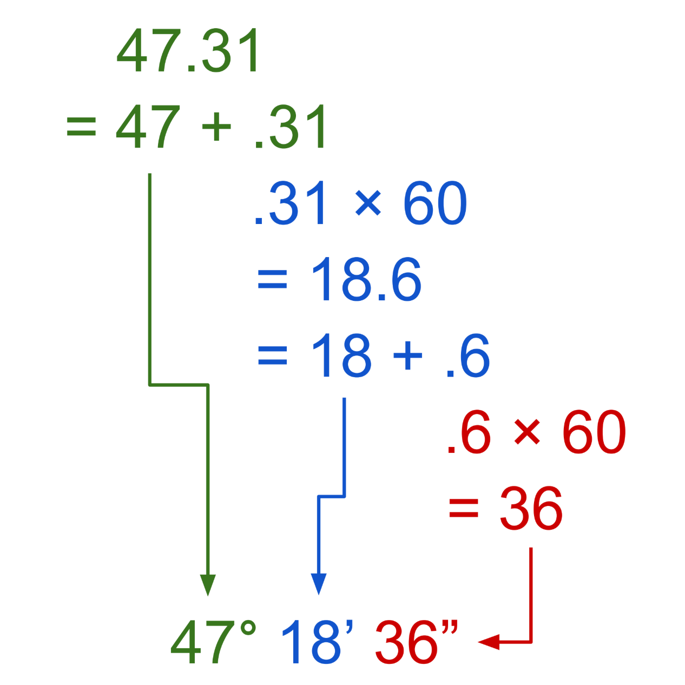
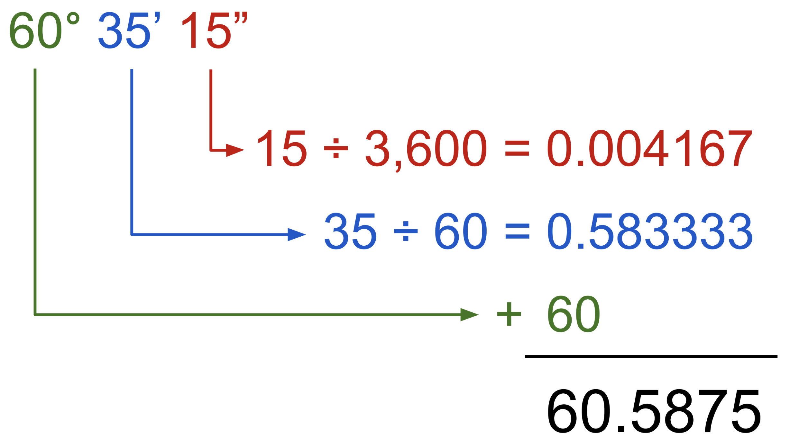

# Lab 08 - Coordinate Converter
This lab will require you to fix some aspects of a Coordinate Converter, such as overloading constructors and performing the actual coordinate conversion! There will be some additional information below the steps if you need to gain a better understanding of today's lab topics.

For ease of access, here is the [javadoc](https://csu-compsci-cs163-4.github.io/Lab08CoordinateConverter/package-summary.html).

## Pre-Step: Testing
As with the last lab, there will be a smaller test file included to test each of your modifications. This file is `ConverterTests.java`, I will once again tell you that it is in your best interests to test each method as you go instead of testing everything at the very end. These tests also do not cover **all** changes you must implement, so you may want to create your own test methods. All that is needed for the tester file is to uncomment the `System.out.println()` lines when you would like to test said method.

## Step 1: Examination and Self-Explanation
To begin with this application I would check out of the **DecimalCoordinate**, **DMSCoordinate**, **DecimalConverter**, and **DMSConverter** classes to get a general overview of their methods and how they may work. Once you feel like you have a general idea, tab into the `ConverterMain` file and view the `go()` method which takes in a parameter of a Scanner object. This is the basic "run" method which grabs the users input and tries to make a **Coordinate** object out of it and subsequently convert it to the opposite type. In a more detailed manner, write or type out your own explanation of what is occurring within the `go()` method to help with your understanding.

## Step 2: Writing your code
The javadoc will include more detailed instructions on how each method and class is composed, the code portions that need your attention are marked with a `//TODO Student`. All problems are located in the `DecimalCoordinate`, `DMSCoordinate`, `DecimalConverter`, and the `DMSConverter` classes. Most of the work you produce for this lab will be within the **Converter** classes where you have to follow and translate the formula for each conversion. The formulas and converters for Decimal to DMS and vice-versa can be found here: [RapidTables.com](https://www.rapidtables.com/convert/number/degrees-minutes-seconds-to-degrees.html). Two very useful visualizations and examples that I found online will be included as images at the bottom of this document.

Remember, try to think of the simple path. For example, in the "convert" methods, you are really just building a new object using information from the other object. As always if you find yourself stuck, it is best to walk away, come back, and solutions often present themselves. Also, try to talk out and articulate errors, that helps a lot with debugging. 

## Step 3: Testing!
Now that you have progressed through each method requiring your assistance, it would be wise to run the included tester file once more and verfiy each test is returning **true**. After each test returns true, try running the `ConverterMain` and seeing how the app works and verifying it actually does work!

## Step 4: Turning into zyBooks
If you have reached this step, chances are you have completed each method and verified they function using the tests, so congratulations! Make sure to turn in through zyBooks!

# Additional Information
## Math.floor(double)
The `Math.floor()` function and `Math` library are an incredibly useful array of methods that assist in math functions, such as `Math.PI` which is a double with the value of Pi!
`Math.floor()` is a method that takes a double as parameter and remove the decimals, converting it to a whole number.
``` java
double dec = 9.546;
System.out.println(dec); //Prints "9.546"
dec = Math.floor(dec);
System.out.println(dec); //Prints "9.0"
```

## Constructor Overloading
As we can overload methods by giving them different parameters, we can also overload objects constructors! So we can have a variety of different constructors that change in function when given different parameters. Such as if we had a car object that we wanted to create, but only had a name or mileage. Based upon the constructor we could create a car with only one of these variables.
``` java
public class Car {
    String name = "";
    int mileage = -1;

    public Car(String name) {
        this.name = name;
    }

    public Car(int mileage) {
        this.mileage = mileage;
    }
}
```
So even if we only had just one name or mileage, we could still construct our Car object and use it until more information acquired to provide to the object.

# Helpful Conversion Examples!

 
