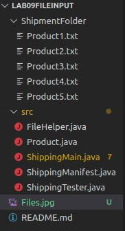

# Lab 09 - File Input
This lab will focus upon String Manipulation and File Input. If you need to brush up on these topics, a small section will be at the lower portion of this document to catch you up on today's topics!

When downloading this program for your use, make sure to download or pull from the [GitHub](https://github.com/CSU-CompSci-CS163-4/Lab09FileInput) to ensure that you have the correct file hierarchy/format needed for this program. For instance, your files should look like this:  

If this is not the configuration of your files you **WILL** run into problems.
(Don't mind the colors, they are for GitHub version control.)

For ease of access, here is the [javadoc](https://csu-compsci-cs163-4.github.io/Lab09FileInput/package-summary.html).

## Pre-Step: Walkthrough
Before beginning this assignment, it is highly recommended to start in `ShippingMain`'s `main` function and try to walkthrough the program. The `Product` and `ShippingManifest` classes are provided as containers for data, they also have their own methods so it will help to check out those classes.

## Step 1: Compilation
As with all Tuesday labs, you should try to compile and run the program. You can try this by running the `ShippingMain.java` file, you will see that some gibberish is printed because we are missing some code in two methods in `ShippingMain.java`. After your efforts, this gibberish should be readable and the App should receive commands and use them!

## Step 2: Self-Explanation
There will be two methods within the `ShippingMain` class for you to self explain and complete. The javadoc will help you formulate and create your self-explanation for these methods. These methods are difficult to explain and create, so it may be of some use to pseudocode along side your actual self-explanation.

Whether you believe your self-explanation is correct or not, try to implement the method based upon it. If you see any changes that are needed apply them to both your self-explanation and code.

## Step 3: Implementation
This step is just to move on to actually implementing your code within your proposed self-explanation. As previously stated, try to implement based off of your explanation, and if you must change something from the explanation, change that too!

## Step 4: Testing
Once you have completed implementing, try to test your `createProduct(Scanner)` method using the provided `ShippingTester` file. There is only one method provided to test this method. If you are so inclined to create more tests to verify it works properly, go ahead it is encouraged!
For testing the next method you implemented, `go(Scanner, ShippingManifest)`, this is up to you to test manually. So try to run through your program a couple of times before turning it in.

## Step 5: Turning In
Make sure to submit your `ShippingMain.java` file to zyBooks and then show your TA your self-explanation and pseudo-code if you did it. Online students do not have the option to submit their self-explanations but they are still highly recommended to complete to better your understanding of the code. 

# Additional Information
## String Manipulation
Strings are incredibly useful for storing multiple characters, they also have some methods that allow us to manipulate and query those characters.
### String.substring(beginIndex, endIndex)
is an incredibly handy method that allows us to slice up our `String` objects into more useful bits. An odd trait of `substring()` is that the first indicates is inclusive, meaning when we slice our `String`, we include that index. The `endIndex` is exclusive and will not include that index in our slice. Also, `endIndex` is optional, and if it is not included, the slice will span from `beginIndex` to the length of your `String` object.

For example:
``` java
String pokemon = "Giratina";
String name = pokemon.substring(4);

System.out.println(pokemon); //Prints "Giratina"
System.out.println(name); //Prints "tina"

String song = "Duckworth";
String animal = song.substring(0, song.indexOf("w"));

System.out.println(song); //Prints "Duckworth"
System.out.println(animal); //Prints "Duck"
```

### String Querying
Finding characters, testing if `String`s are equal, or testing what a `String` starts with a useful interactions that we can already do with `String`s.

`String.contains(String)` is a useful function that returns a boolean when the first `String` contains the second `String`.
``` java
String bk = "Royale With Cheese";
String cheese = "Cheese";

System.out.println(bk.contains(cheese)); //Prints true
```

`String.startsWith(String)` is a method returns a boolean, true if the first `String` contains, at the the beginning, the second `String`.
``` java
String country = "Portugal";

System.out.println(country.startsWith("Port")); //Prints true
```

## File Input
File Input is quite a large subject to go over in a lab README, so look at your notes/lecture notes to get the full understanding, but I will provide some helpful methods.

`File` objects can be needed as a parameter for `Scanner` objects to read the selected file, like so: (Assume we have access to this file)
``` java
File newFile = new File("testfile.txt") //Parameter is the file path.
Scanner scnr = new scnr(newFile);

String firstFileLine = scnr.nextLine();
```

Once you have a `Scanner` that is associated with your file, you can use methods like `Scanner.nextLine()` and `Scanner.next()` to actually read from your selected file.

If we had this file name `test.txt`:
```
Hi there
Nice to meet ya!
```
And this snippet will have an associated `Scanner` read the file:
``` java
String firstLine = scnr.nextLine() //Equals "Hi there"
String firstWord = scnr.next(); //Equals "Nice"
String secondWord = scnr.next(); //Equals "to"
String thirdPart = scnr.nextLine(); //Equals "meet ya!"
```
I find it easiest to imagine that the `Scanner` constantly has a pointer in the file that it increments differently, depending on if `next()` or `nextLine()` is called.

Thanks for coming to my TED talk.
